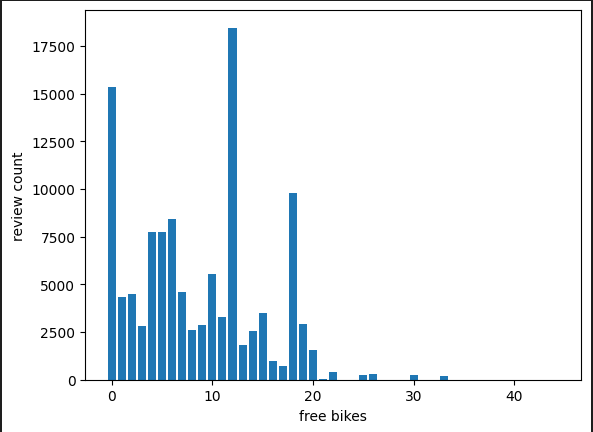
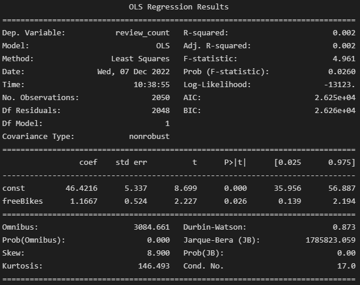

# Final-Project-Statistical-Modelling-with-Python

## Project/Goals
The goal for this project is to ultize the api's from foursquare, yelp, and citybike to derive meaningful data and discover if there is any meaningful correlation between the restaurants and the bikestations in Toronto

## Process
### Step 1: Data gathering for Bike stations
Data was gathered involving the bike stations in toronto using the city bikes api and parsed through and organized
### Step 2: Data gathering for bike stations
Data was similarly gathered for the restaruants nearby the bikestations, collecting data for restaurants within 1000m of any bikestations
### Step 3: Data Parsing and Cleaning
the Data collected were than put into dataframes and joined together - The data was than cleaned through to remove duplicate restaruant data, as well as handling missing Data values
### Step 4 : gathering results
Afterwards using the data collected, graphs and models were created to try and interpret the data

## Results
One point of interest chosen was the ammount of review counts a restaruant had and how it could relate to the ammount of availible bikes in an area

from my results I concluded that the ammount of reviews vs free bikes have a small relationship where the review count doesn't seem to be affected by the ammount of free bikes for the most part

## Challenges 
Cleaning and parsing the data was the most difficult task. Each api worked diffrently but foursquare API was the most difficult to work with, some restaurants were missing values (longitude and latiude) and some given data was nonsensical

original I used a sample of 200 resturants just to save time, I forgot about it until i was finished, once I redid my work using a full sample size I found that I didn't reach the same conclusions as I originally did

I also felt I had difficultiues making good use of the data and may have done some of work inefficently

## Future Goals
in the future I would like to parse and clean my data better and ultize the data better to find more meaningful and interesting results
